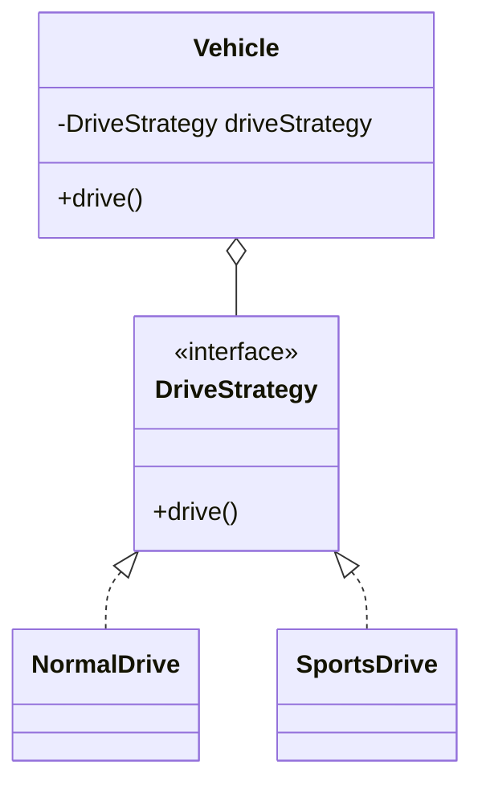
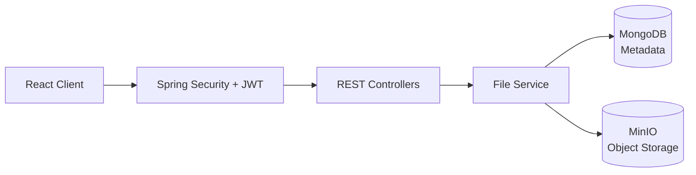

<h1 align="center">Garvit Malik</h1>

<h3 align="center">Java Backend Developer &nbsp;•&nbsp; Spring Boot &nbsp;•&nbsp; LLD &amp; System Design</h3>

<p align="center">
  
</p>

<p align="center">
  <a href="https://github.com/garvitmalik-123"></a>
  <a href="https://linkedin.com/in/garvit-malik-517ab4425/"></a>
  <a href="https://leetcode.com/u/Garvitmalik-123/"></a>
  <a href="mailto:garvitmalik275@gmail.com"></a>
</p>

---

## 🚀 About Me

| | |
|---|---|
| 💻 **Focus** | Building scalable, production-ready backend systems |
| 🌱 **Learning** | Spring Boot, Microservices, LLD & System Design |
| 🛠️ **Building** | Java + Spring Boot + MySQL + MongoDB |
| 🧠 **Practicing** | DSA, OOP, SOLID Principles & Design Patterns |
| ⚡ **Exploring** | Kafka, Redis, Docker & Distributed Systems |
| 🎯 **Goal** | Backend Engineer at a Product-Based Company |

---

## 🛠️ Tech Stack

<p align="center">
  
</p>

---

## 🧠 LLD & System Design

<table>
  <tr>
    <td width="50%" valign="top">
      <h4>📐 Object-Oriented Programming</h4>
      
      
      
      
      
    </td>
    <td width="50%" valign="top">
      <h4>🧱 SOLID Principles</h4>
      <b>S</b> Single Responsibility<br/>
      <b>O</b> Open/Closed<br/>
      <b>L</b> Liskov Substitution<br/>
      <b>I</b> Interface Segregation<br/>
      <b>D</b> Dependency Inversion
    </td>
  </tr>
  <tr>
    <td valign="top">
      <h4>🎯 Design Patterns Practiced</h4>
      • Strategy Pattern<br/>
      • Simple Factory Pattern<br/>
      • Factory Method Pattern<br/>
      • Abstract Factory Pattern
    </td>
    <td valign="top">
      <h4>📝 LLD Concepts</h4>
      • Class & Object Design<br/>
      • Interfaces & Abstraction<br/>
      • Composition over Inheritance<br/>
      • UML Class & Sequence Diagrams<br/>
      • Maintainable, reusable components<br/>
      • Basic Document Editor Design<br/>
      • Basic Car / Vehicle System Design
    </td>
  </tr>
</table>

<details>
<summary><b>🎯 Strategy Pattern at a glance</b></summary>
<br/>



</details>

---

## 📌 Projects

<table>
  <tr>
    <td width="33%" valign="top">
      <h3>☁️ <a href="https://github.com/garvitmalik-123/Cloud-Vault-Enterprise-Storage-Application">CloudVault</a></h3>
      <p>Secure cloud storage app to upload, download, manage and share files with JWT-based auth and protected file access.</p>
      
      
      
      
    </td>
    <td width="33%" valign="top">
      <h3>☕ <a href="https://github.com/garvitmalik-123/VelvetBean-Cafe">Velvet Bean Cafe</a></h3>
      <p>Modern, responsive café website to browse the menu and signature coffee with a smooth, premium UI.</p>
      
      
      
    </td>
    <td width="33%" valign="top">
      <h3>🔄 <a href="https://github.com/garvitmalik-123/Skill-Swap">Skill Swap</a></h3>
      <p>Platform where users exchange skills, learn from each other and earn skill points.</p>
      
      
      
    </td>
  </tr>
</table>

<details>
<summary><b>🏛️ CloudVault architecture</b></summary>
<br/>



</details>

---

## 💡 Core Strengths

| Area | Focus |
|------|-------|
| 🧠 Problem Solving | DSA |
| 🏗️ Low-Level Design | OOP, SOLID & Design Patterns |
| 🏢 System Design | Backend architecture |
| 🔗 API Development | REST, JWT, Spring Security |
| 🗄️ Databases | MySQL & MongoDB design |
| 🌐 Learning | Distributed systems |

---

## 📊 GitHub Stats

<p align="center">
  
  
</p>

<p align="center">
  
</p>

## 🧩 LeetCode

<p align="center">
  
</p>

## 🐍 Contribution Snake

<p align="center">
  
</p>

---

## 👨‍💻 Developer Mindset

```java
while (true) {
    Learn();
    Build();
    Solve();
    Design();
    Improve();
}
```

---

## 🤝 Let's Connect

<p align="center">
  <a href="https://github.com/garvitmalik-123"></a>
  &nbsp;
  <a href="https://linkedin.com/in/garvit-malik-517ab4425/"></a>
  &nbsp;
  <a href="https://leetcode.com/u/Garvitmalik-123/"></a>
</p>
